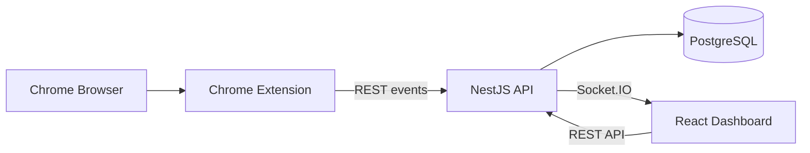
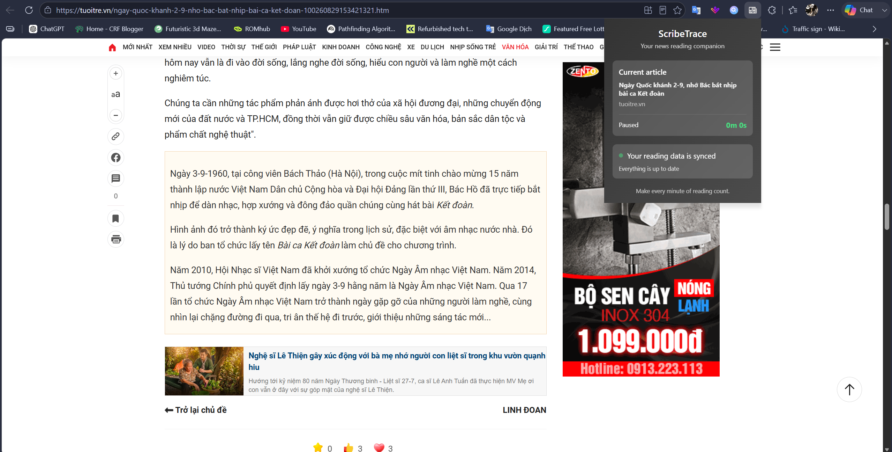
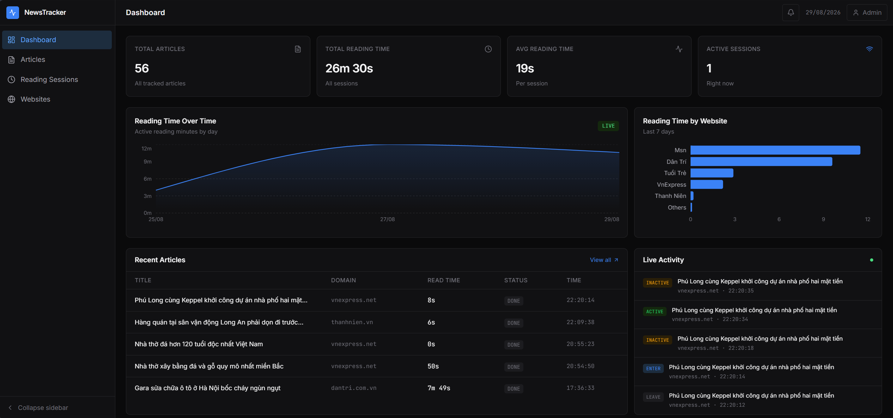
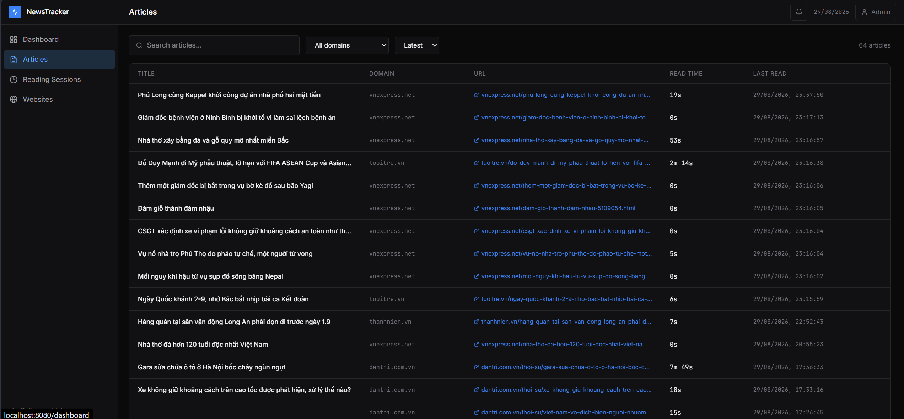
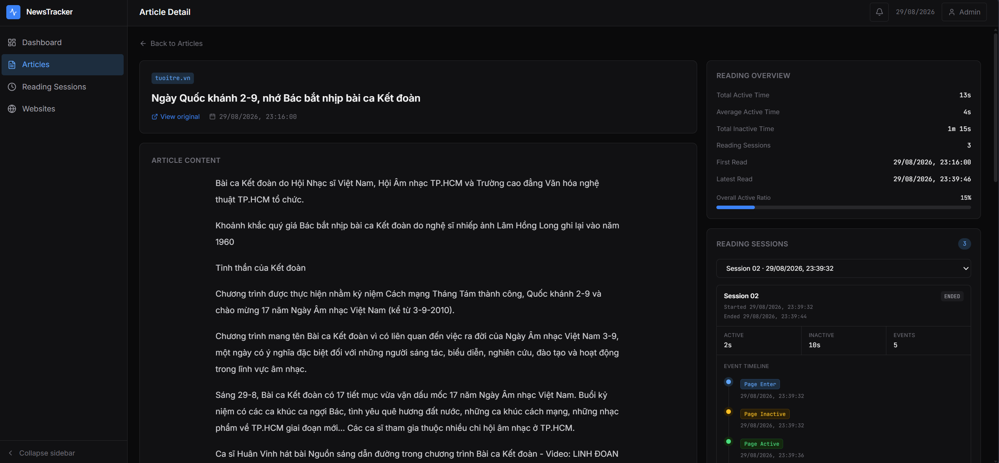
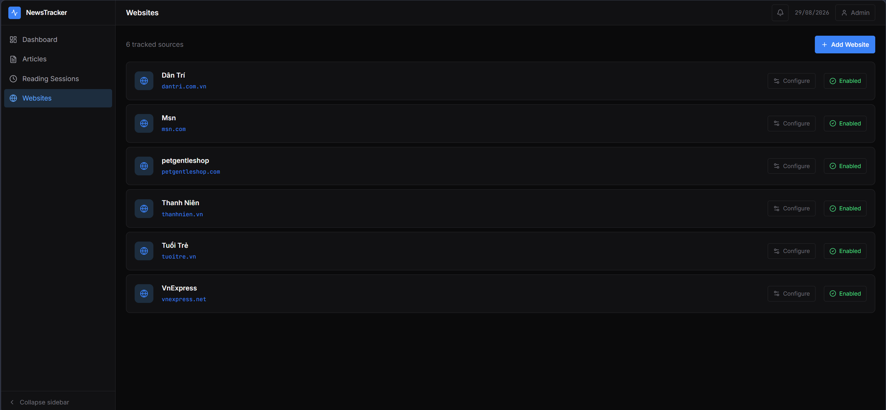

## Kiến trúc hệ thống



Hệ thống gồm ba thành phần chính:

- `browser-extension`: phát hiện bài báo, trích xuất nội dung và ghi nhận trạng thái đọc.
- `backend`: nhận event, quản lý session, lưu dữ liệu và phát sự kiện realtime.
- `frontend`: dashboard dành cho admin để theo dõi bài báo, session, website và thông báo.

## Công nghệ sử dụng

- Chrome Extension Manifest V3
- Mozilla Readability
- NestJS
- Prisma ORM
- PostgreSQL
- Socket.IO
- React, Vite và Recharts
- Docker Compose

## Cài đặt và chạy hệ thống

### Yêu cầu

- Docker Desktop
- Trình duyệt

### 1. Tạo file môi trường

Tạo file `backend/.env`:

```env
DATABASE_URL=...
JWT_ACCESS_SECRET=...
JWT_REFRESH_SECRET=...
```

### 2. Khởi động hệ thống

Tại thư mục gốc của dự án:

```powershell
docker compose -f docker-compose.dev.yml up -d --build
```

Tạo hoặc cập nhật schema database:

```powershell
docker compose -f docker-compose.dev.yml exec backend npx prisma db push
```

### 3. Tạo tài khoản admin

Lệnh dưới đây tạo tài khoản demo `admin@gmail.com` với mật khẩu `123`:

```powershell
docker compose -f docker-compose.dev.yml exec backend npm run seed:admin
```

Đăng nhập tại `http://localhost:8080` bằng:

```text
Email: admin@gmail.com
Password: 123
```

### 4. Cấu hình website

Sau khi đăng nhập, mở trang **Websites** và thêm website ví dụ như:

| Name | Domain |
|---|---|
| VnExpress | `vnexpress.net` |
| Dân Trí | `dantri.com.vn` |
| Tuổi Trẻ | `tuoitre.vn` |

`Title Selector` và `Content Selector` là tùy chọn. Nếu để trống, extension sử dụng Readability. Nếu có cấu hình, extension ưu tiên CSS selector đã nhập. Có thể dùng **Remove Configuration** để xóa cả hai selector và quay lại sử dụng Readability.

### 5. Cài Chrome Extension

1. Mở `chrome://extensions`.
2. Bật **Developer mode**.
3. Chọn **Load unpacked**.
4. Chọn thư mục `browser-extension` của dự án.
5. Mở một bài báo thuộc website đã cấu hình.



### 6. Dừng hệ thống

```powershell
docker compose -f docker-compose.dev.yml down
```

## Chức năng hệ thống

### Thu thập dữ liệu trình duyệt

Content script chỉ bắt đầu tracking khi domain hiện tại nằm trong danh sách website được bật trên server. Trang chủ không được coi là bài báo.

Thông tin thu thập gồm:

- URL và domain.
- Tiêu đề và nội dung chính.
- Thời điểm bắt đầu và kết thúc session.
- Thời gian active và inactive.
- Trạng thái của tab.

Nội dung được lấy theo hai cách:

1. Nếu website có `titleSelector` và `contentSelector`, extension lấy dữ liệu theo cấu hình.
2. Nếu không có cấu hình, extension sử dụng Readability. Nội dung trong Shadow DOM dạng `open` được sao chép vào DOM trước khi đưa qua thư viện.

Thời gian đọc thực tế không được tính chỉ dựa trên thời gian tab tồn tại. Session chỉ ở trạng thái `ACTIVE` khi đồng thời thỏa mãn:

- Tab đang được chọn.
- Cửa sổ trình duyệt đang được focus.
- Trang đang visible.
- Người dùng vừa mở, quay lại bài viết hoặc có thao tác scroll, click, chạm hay nhấn phím trong 45 giây gần nhất.

Khi một trong các điều kiện không còn đúng hoặc không có tương tác trong 45 giây, extension phát `PAGE_INACTIVE` và dừng cộng thời gian active. Khi người dùng quay lại hoặc tương tác với bài viết, extension bắt đầu lại bộ đếm 45 giây và phát `PAGE_ACTIVE` nếu các điều kiện còn lại đều hợp lệ.

### Thiết kế Event

Các loại event:

- `PAGE_ENTER`
- `PAGE_ACTIVE`
- `PAGE_INACTIVE`
- `PAGE_LEAVE`

Cấu trúc event chính:

```json
{
  "eventId": "uuid",
  "sessionId": "uuid",
  "clientSeq": 1,
  "eventType": "PAGE_ENTER",
  "url": "https://....com/article",
  "title": "Article title",
  "occurredAt": "...",
  "page": {
    "url": "https://....com/article",
    "domain": "....com",
    "title": "Article title",
    "content": "Article content"
  },
  "browser": {
    "tabId": 10,
    "windowId": 1
  }
}
```

Mỗi tab và mỗi lần truy cập bài báo có một `sessionId` UUID riêng. `clientSeq` tăng dần trong session để giữ thứ tự event. `eventId` được tạo bằng UUID và dùng làm khóa chống lưu trùng ở server.

Lưu event thay vì chỉ lưu bản tổng hợp giúp giữ lại toàn bộ timeline, xử lý retry an toàn, kiểm tra trạng thái session và tính lại thời gian đọc khi cần.

### Central Server

Backend cung cấp các API chính:

| Method | Endpoint | Chức năng |
|---|---|---|
| `POST` | `/api/events` | Nhận một event |
| `POST` | `/api/events/batch` | Nhận các event được lưu khi offline |
| `GET` | `/api/sessions` | Truy vấn lịch sử session |
| `GET` | `/api/sessions/:id` | Xem session và timeline event |
| `GET` | `/api/articles` | Truy vấn danh sách bài báo |
| `GET` | `/api/articles/:id` | Xem nội dung và các session của bài báo |
| `GET` | `/api/websites/tracked` | Lấy website được extension theo dõi |

Input được kiểm tra bằng DTO và `class-validator`. Event, article và reading session được lưu trong PostgreSQL thông qua Prisma.

Khi nhận event, backend cập nhật thời gian active/inactive của session trong transaction. Event đã tồn tại được nhận diện bằng `eventId` và không xử lý lại.

### Dashboard

Dashboard gồm:

- Tổng số bài báo.
- Tổng thời gian và thời gian đọc trung bình.
- Số session đang active.
- Biểu đồ thời gian đọc theo ngày.
- Biểu đồ thời gian đọc theo website.
- Danh sách bài báo gần đây.
- Danh sách hoạt động realtime.
- Trang chi tiết bài báo, nội dung, thời gian đọc và timeline theo từng session.
- Danh sách reading session.
- Cấu hình website và CSS selector.
- Cảnh báo khi title hoặc content trích xuất được quá ngắn.

Backend phát `reading:event` và `reading:session-updated` qua Socket.IO. Dashboard nhận event mới và cập nhật dữ liệu mà không cần reload trang.

Trường `summary` đã có trong database và giao diện, nhưng chức năng sinh summary thuộc phần AI nên chưa được triển khai.

#### Dashboard tổng quan



#### Danh sách bài báo



#### Chi tiết bài báo



#### Quản lý website



### Xử lý một số tình huống thực tế

#### 1. Mở đồng thời nhiều tab

Extension lưu session theo `tabId`. Mỗi tab có `sessionId`, trạng thái và bộ đếm event riêng nên không ghi đè dữ liệu của nhau.

#### 2. Chuyển liên tục giữa các tab

Sự kiện `tabs.onActivated` kích hoạt việc đánh giá lại toàn bộ session. Tab vừa rời phát `PAGE_INACTIVE`, tab được chọn phát `PAGE_ACTIVE`.

#### 3. Mở tab nhưng không thao tác lâu

Khi bài viết được mở, extension bắt đầu bộ đếm 45 giây. Thao tác scroll, click, chạm, nhấn phím hoặc quay lại tab sẽ đặt lại bộ đếm. Nếu không có tương tác trong 45 giây, session chuyển sang `INACTIVE` và thời gian đó không được tính là thời gian đọc. Tương tác trở lại sẽ chuyển session sang `ACTIVE` nếu tab đang được chọn, cửa sổ đang focus và trang đang visible.

#### 4. Chrome đóng đột ngột

Session đang chạy được lưu trong `chrome.storage.local`. Extension định kỳ lưu `lastObservedAt`. Khi Chrome mở lại, các session không còn khớp với tab hiện tại được kết thúc tại mốc quan sát gần nhất và gửi `PAGE_LEAVE` về server.

#### 5. Gửi trùng event

Mỗi event có một `eventId` UUID riêng. Trước khi xử lý, backend kiểm tra ID này đã tồn tại hay chưa. Nếu extension gửi lại một event đã được lưu, backend không lưu thêm và không tính thời gian đọc lần thứ hai.

#### 6. Mất kết nối Internet

Event gửi thất bại được lưu vào `pendingEvents` trong `chrome.storage.local`. Alarm của extension thử đồng bộ lại mỗi phút qua API batch.

#### 7. Website thay đổi cấu trúc HTML

Website không có cấu hình sử dụng Readability nên không phụ thuộc vào class cố định. Admin có thể thêm CSS selector cho website cần xử lý riêng. Khi Readability không xử lý được thì sẽ có thông báo lỗi để biết website nào đang lỗi để chỉnh sửa cấu hình.

## Các chức năng đã hoàn thành

- Chrome Extension theo dõi các website tin tức đã cấu hình, thu thập URL, domain, tiêu đề, nội dung, thời điểm bắt đầu, thời điểm kết thúc, thời gian đọc và trạng thái trang/tab. Thời gian đọc thực tế được xác định dựa trên tab đang active, cửa sổ trình duyệt, trạng thái hiển thị và tương tác của người dùng.
- Ghi nhận các event `PAGE_ENTER`, `PAGE_ACTIVE`, `PAGE_INACTIVE` và `PAGE_LEAVE`. Mỗi event có mã định danh, session, thời gian và dữ liệu trạng thái tương ứng.
- Backend kiểm tra và lưu trữ event, session, bài báo và lịch sử đọc trong PostgreSQL; cung cấp API tiếp nhận event và truy vấn session, bài báo.
- Dashboard hiển thị realtime danh sách và chi tiết bài báo, nội dung, tổng thời gian đọc, timeline event và các biểu đồ thống kê.
- Xử lý các trường hợp mở nhiều tab, chuyển tab liên tục, không thao tác lâu, đóng Chrome đột ngột, gửi trùng event, mất kết nối Internet và website thay đổi cấu trúc HTML.

## Các hạn chế

- Backend chưa tự đánh dấu session quá hạn nếu Chrome không được mở lại.

## Các quyết định kỹ thuật chính

### Lưu event và session song song

Event giữ timeline nguyên bản, còn session giữ dữ liệu tổng hợp để dashboard truy vấn nhanh. Cách này vừa hỗ trợ kiểm tra lịch sử vừa tránh phải tính lại toàn bộ event ở mỗi request.

### UUID và client sequence

`eventId` giúp retry an toàn, `sessionId` phân biệt từng lần đọc, còn `clientSeq` giữ thứ tự sự kiện trong cùng session.

### Tính thời gian ở backend

Extension chỉ phát thay đổi trạng thái và timestamp. Backend sẽ là nơi tính khoảng thời gian giữa các event.

### Readability kết hợp cấu hình

Readability được dùng cho website thông thường để hạn chế phụ thuộc HTML. CSS selector chỉ được cấu hình cho website cần cách lấy dữ liệu cụ thể.

## Cấu trúc thư mục

```text
scribetrace/
├── backend/
├── browser-extension/
├── docs/
│   └── images/
├── frontend/
├── docker-compose.dev.yml
└── README.md
```
